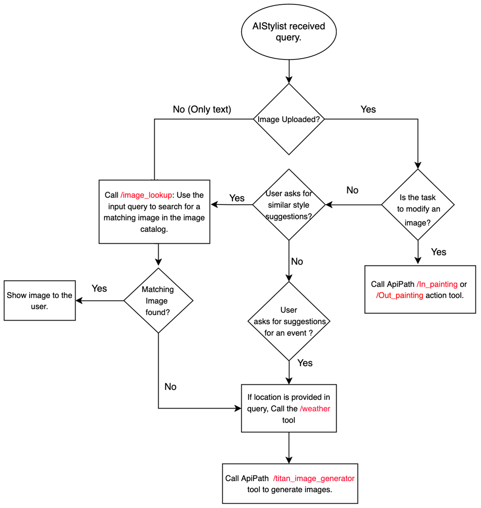

# Fashion Assistant agent
This project is a fashion assistant agent built with Amazon Titan models and Agents for Amazon Bedrock, aimed at providing users with personalized fashion advice and experience.

## Features

- **Image-to-Image or Text-to-Image Search**: Allows users to search for products from the catalog that are similar to styles they like.
- **Text-to-Image Generation**: If the desired style is not available in the database, it can generate customized images based on the user's query.
- **Weather API Integration**: By fetching weather information from the location mentioned in the user's prompt, the agent can suggest appropriate outfits for the occasion.
- **Outpainting**: Users can upload an image and request to change the background, allowing them to visualize their preferred styles in different settings.
- **Inpainting**: Enables users to modify specific clothing items in an uploaded image, such as changing the design or color.

## Flow Chart



## Prerequisites

- An active AWS account and IAM role (with permissions for Bedrock, Lambda, and S3)
- Access to Anthropic Claude-3 Sonnet, Amazon Titan Image Generator, and Titan Multi-modal Embedding models enabled
- Prepare required datasets (e.g., fashion images from Kaggle)
- Install required Python libraries (e.g., Streamlit)


# FashionAgent CDK Setup

## Prerequisites

### Install Node Version Manager (nvm)

- It is recommended to install Node.js and npm using the Node Version Manager (nvm). Follow the installation instructions from the official GitHub repository: https://github.com/nvm-sh/nvm

### Install Node.js and npm (without nvm)

1. **macOS**:

   - Install Node.js and npm using a package manager like [Homebrew](https://brew.sh/):
     ```bash
     brew install node
     ```
2. **Windows**:

   - Download and install the latest LTS version of Node.js from the official website: https://nodejs.org/en/download/
3. **Linux**:

   - Follow the instructions from the official Node.js website for your Linux distribution: https://nodejs.org/en/download/package-manager/

### Install AWS CDK

1. Install the AWS CDK using npm:
   ```bash
   npm install -g aws-cdk
   ```

## Installation

1. Install Python requirements:
   ```bash
   pip install -r requirements.txt
   ```

## Deployment

1. Change directory into the project directory:
2. Synthesize the CloudFormation template:

   ```bash
   cdk synth
   ```
3. Deploy the CDK stack and capture outputs:

   ```bash
   cdk deploy --outputs-file variables.json
   ```
4. (Optional) Cleanup and delete resources:
   To delete the deployed resources and the CloudFormation stack, run:

   ```bash
   cdk destroy
   ```

## Ingest Embeddings
To use the image lookup feature, run the ``opensearch_ingest.ipynb`` notebook to create a vector store. It uses the Titan Multi-modal Embedding model to embed and ingest the image embeddings to [OpenSearch Serverless](https://aws.amazon.com/opensearch-service/features/serverless/).

## Configuration

The `config.yml` file in the `cdk` directory contains several variables that you need to set for the FashionAgent to work correctly.

- `schema_name` : This is the name of the schema file used to define the agent API. It is typically set to `"FashionAgent_Schema.json"`.

- `foundation_model`: This is the Anthropic model that will be used as the base for the FashionAgent. The default value is `"anthropic.claude-3-sonnet-20240229-v1:0"`.

- `agent_name`: This is the name of the FashionAgent. The default value is `"FashionAgent"`.

- `bucket_name`: This is the name of the S3 bucket that will be used to store images. If left blank, it will default to `"fashion-agent-{account}-{region}"`, where `{account}` is your AWS account ID, and `{region}` is the AWS region you are deploying to.

- `embeddingSize`: This is the size of the embeddings that will be stored in the OpenSearch index. The default value is `"1024"`. The size of Titan multimodal emebeddings.

- `opensearch.deploy`: This is a boolean value that determines whether the OpenSearch deployment should be included in the CDK deployment or not. The default value is `True`.

- `opensearch.opensearch_index_name`: This is the name of the OpenSearch index that will be created. The default value is `"images-index"`.

- `opensearch.opensearch_collection_name`: This is the name of the OpenSearch collection that will be created within the index. The default value is `"fashion-image-collection"`.

- `opensearch.opensearch_arns`: This is a list of AWS Identity and Access Management (IAM) role ARNs that will be granted access to the OpenSearch collection. You need to replace the default value with your own IAM role ARN.

To find your IAM role ARN, you can use the AWS CLI:

1. Install the AWS CLI if you haven't already done so. Follow the instructions in the [AWS CLI documentation](https://docs.aws.amazon.com/cli/latest/userguide/cli-chap-install.html).
2. Run the following command to get your IAM role:

   ```
   aws sts get-caller-identity
   ```
3. Replace the default value in the `opensearch_arns` list with your role ARN.

Granting your IAM role access to the OpenSearch collection allows you to write embeddings to OpenSearch from your application.

## Running the streamlit Demo UI

1. Run the following command run the streamlit demo UI:

   ```
   streamlit run frontend/app.py
   ```
2. A web browser will open the Demo UI


## Cleanup

To avoid unnecessary costs, make sure to delete the resources used in this solution using `cdk destroy`
