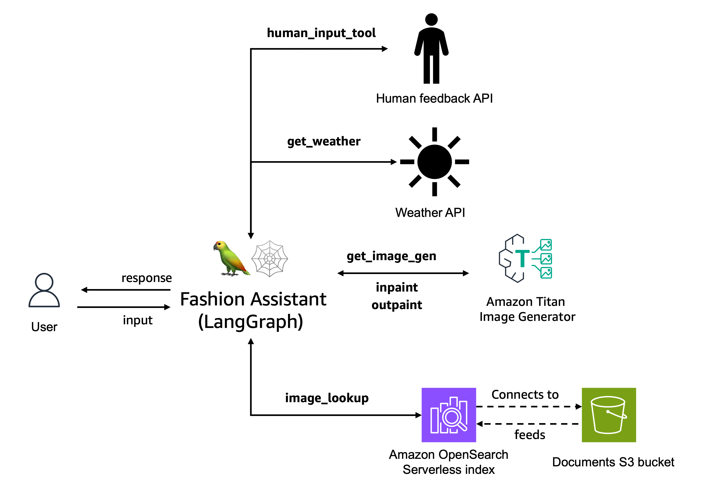

# Fashion Assistant agent
Whether it's a formal event, a casual hangout, or a job interview, having the right outfit can boost your confidence and make a lasting impression. Imagine having a virtual stylist at your fingertips, ready to assist you with outfit choices and accessorizing. In this hands-on workshop, you'll learn how to create an AI agent that can help you style yourself for different occasions.

By leveraging the power of LLMs and LangChain, you’ll build an agent that can understand style preferences, occasion details, and wardrobe to provide personalized outfit recommendations. This workshop will teach you how to define the necessary tools, prompt the language model effectively, and orchestrate the agent's reasoning process. You'll also learn how to integrate external data sources, such as weather APIs or clothing databases, to enhance the agent's capabilities. 

The architecture that we will build will look as following:

The agent that we are creating has the capability of performing the following tasks:
- **Image-to-Image or Text-to-Image Search**: Allows users to search for products from the catalog that are similar to styles they like.
- **Text-to-Image Generation**: If the desired style is not available in the database, it can generate customized images based on the user's query.
- **Weather API Integration**: By fetching weather information from the location mentioned in the user's prompt, the agent can suggest appropriate outfits for the occasion.
- **Outpainting**: Users can upload an image and request to change the background, allowing them to visualize their preferred styles in different settings.
- **Inpainting**: Enables users to modify specific clothing items in an uploaded image, such as changing the design or color.
- **Handle human input**: the agent can require human input from the agent's actions or thoughts

Before we start, let's explore a couple of background concepts:

### Semantic Search
Generative AI has enabled many different business applications. One of the most popular ones is the ability to do semantic search.

Semantic search refers to the ability to understand the meaning and intent behind a user's query, rather than simply matching keywords. This approach leverages natural language processing (NLP) and machine learning (ML) techniques to comprehend the contextual and conceptual aspects of the query, enabling more accurate and relevant search results.

One key component of semantic search is the use of multi-modal embeddings. These embeddings represent different types of data, such as text and images in a common vector space, allowing for cross-modal comparisons and retrieval. By encoding different modalities into a shared embedding space, semantic search can effectively handle multi-modal queries and provide results that span various data types.

Traditional search systems, on the other hand, primarily rely on metadata-based indexing and keyword matching. They analyze the textual content of documents or resources, extracting keywords, tags, and other metadata, and use this information to match user queries. While effective for simple keyword-based searches, traditional systems often struggle with understanding the deeper meaning and context of queries, especially when dealing with complex or ambiguous language.

In contrast, semantic search leverages the power of multi-modal embeddings to capture the semantic relationships between different data modalities, enabling a more holistic understanding of the query and the available information. This approach can provide more relevant and contextually appropriate results, even when the query or the desired information spans multiple data types or modalities.

When creating our agent, we will use the [Amazon Titan Multimodal Embeddings Model](https://docs.aws.amazon.com/bedrock/latest/userguide/titan-multiemb-models.html) to easily create embeddings for existing images and texts as well as for use queries in order to find similar styles in our fashion agent.

### Image Generation and Image Editting

Another field that Generative AI has revolutionized is the field of image generation and editing. It has empowered users to create and manipulate images and visual content with natural language prompts and reference images. It can generate realistic images of products in different environments or with customized features, aiding in marketing and sales efforts. It has also been employed in fields like architecture and design, enabling the creation of concept art, visualizations, and virtual environments with remarkable detail and accuracy.

For our virtual assistant, we will apply [Amazon Titan Image Generator](https://docs.aws.amazon.com/bedrock/latest/userguide/titan-image-models.html) to create and update fashion photos. We will pass prompts for modifying a mask to match the surrounding background in the input images using inpainting. That will allow us to inpaint the outfits to our individual style. We will also use it to change backgrounds and experiment with our style in different environments using outpainting.

## Flow Chart
Let's now take a look at the flow chart of our agent's actions:

## Prerequisites

- An active AWS account and IAM role (with permissions for Bedrock and S3)
- Access to Anthropic Claude-3 Sonnet, Amazon Titan Image Generator, and Titan Multi-modal Embedding models enabled
- Prepare required datasets 
- Install required Python libraries 

## Implementation

When workshop environment is deployed, a Amazon Opensearch Serverless collection is created to store the vector embeddings of your fashion image dataset.

#### Step 1. Data Ingestion to Amazon OpenSearch Serverless

To quickly search for similar styles, we need a vector database to store multi-modal embeddings of our fashion dataset. 
You can use different tools for such task. For this workshop, we will use the serverless option: [Amazon OpenSearch Serverless (AOSS)](https://aws.amazon.com/opensearch-service/features/serverless/), so that AWS can handle the infrastructure of the vector database for us.

In `[Step 1](langgraph_implementation/Step1_populate_AOSS_index.ipynb)` we will download of test data, create the multi-modal embeddings and ingest the vector representations of our data into an AOSS collection.

The pre-requisite infrastructure for this lab is already created for you and we will use [AWS Systems Manager Parameter Store](https://docs.aws.amazon.com/systems-manager/latest/userguide/systems-manager-parameter-store.html) to access them. 

#### Step 2. LangGraph Agent Interaction

Once our data is embedded and stored in our vector database, we will create our agent in `[Step2](langgraph_implementation/Step2_langgraph_agent.ipynb)`. We will also test and interact with this agent with your fashion requests.

#### STEP 3. Cleanup

To avoid unnecessary costs, make sure to delete the resources used in this solution using this notebook.
